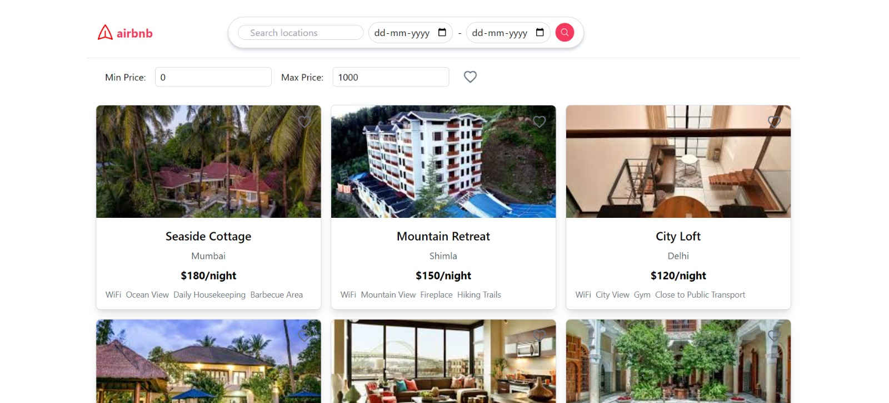

# Airbnb Clone README

## Project Overview

This project is an Airbnb clone with a modern design and essential features for booking accommodations. The project is structured into two main folders: frontend and backend. The frontend is built with React using Vite, and the backend uses Node.js, Express, and MongoDB Atlas for the database.

## Features

- *Search Functionality*: Users can search for listings based on location, date, and price range.
- *Responsive Design*: The frontend features a modern and responsive design.
- *Dynamic Data Rendering*: Listings are dynamically fetched and rendered from the database.
- *Booking Management*: Users can view available dates and make bookings.
## Project Structure

### Frontend

The frontend folder contains the React application:

-   public/ - Static files
-   src/ - Source files
    -   components/ - Reusable components
    -   pages/ - Application pages
    -   styles/ - CSS and style files
    -   utils/ - Utility functions
    -   App.jsx - Main application component
    -   main.jsx - Entry point

### Backend

The backend folder contains the Node.js and Express application:

-   models/ - Mongoose models
-   routes/ - API routes
-   server.js - Entry point

## Screenshots


(Include some screenshots of your application here)

## Getting Started

### Prerequisites

- Node.js
- npm or yarn
- MongoDB Atlas account

### Installation

1. *Clone the repository:*

   ```bash
   git clone "url"
   cd frontend
2. **Install Dependencies:**

   ```bash
	npm install
3. *Run the react app:*

   ```bash
	npm run dev
4. **Run the backend:**

   ```bash
	cd backend
	npm install
5. *Create .env*
	In .env add your mongodb atlas uri 
	ex:
	  ```bash
	MONGO_URI = "your uri"
6. **Run the backend:**

   ```bash
	node server.js
